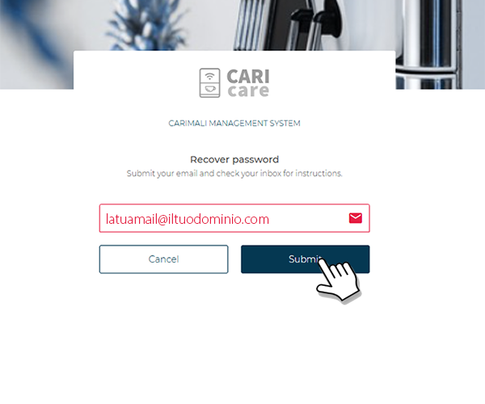
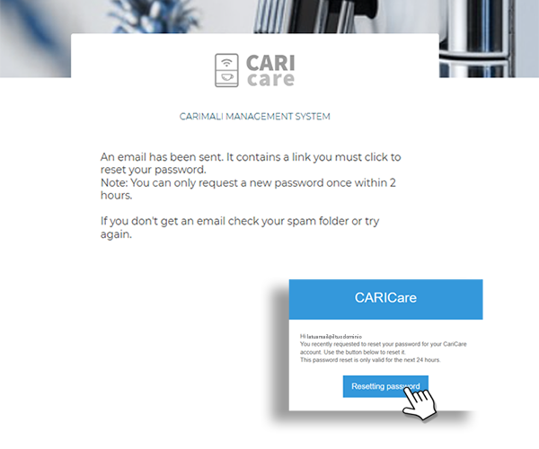

# Recupero password

Nel caso in cui la password di accesso sia stata dimenticata, è possibile reimpostarla seguendo la procedura descritta di seguito.

1. Aprire il browser del dispositivo e digitare l’indirizzo [https://caricare.carimali.com/login](https://caricare.carimali.com/login), quindi premere **Invio** per accedere alla pagina di autenticazione.

2. Nella schermata di **Login**, selezionare l’opzione **Forgot Password**, come mostrato nell’immagine seguente:

   <kbd></kbd>

3. Nella pagina **Password dimenticata** (Forgot password), inserire l’**indirizzo e-mail** associato all’account **CARIcare**, quindi premere **Submit** per inviare la richiesta di recupero.
   È possibile annullare l’operazione premendo **Cancel**.

   <kbd></kbd>

4. Accedere alla casella di posta elettronica corrispondente all’indirizzo inserito.
   Verrà ricevuta una mail da **`caricare@carimali.com`** contenente il link per il ripristino.
   Selezionare **Resetting password** per procedere.

   <kbd></kbd>

5. Nella schermata successiva, digitare la **nuova password**, ripeterla per conferma e premere **Cambia password** per completare l’operazione.
   Al termine, eseguire nuovamente il **Login** con le nuove credenziali.

   <kbd></kbd>
