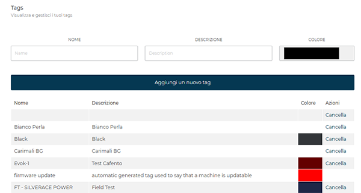
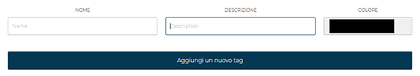

# Gestione dei Tag

La sezione **Tag** consente di creare, visualizzare e gestire etichette personalizzate utili per raggruppare e identificare una o più macchine.
Ogni tag può includere un **nome**, una **descrizione** e un **colore** per una rapida identificazione.

<kbd></kbd>

## Creazione di un nuovo tag

Per creare un nuovo tag, compilare i seguenti campi:

* **Nome** – identificativo del tag.
* **Descrizione** – testo esplicativo della funzione o del gruppo di macchine.
* **Colore** – selezionare il colore di riferimento.

Premere **Aggiungi un nuovo tag** per completare l’operazione.

<kbd></kbd>

## Elenco dei tag esistenti

La parte inferiore della pagina mostra l’elenco dei tag creati, con la possibilità di modificarli o eliminarli.
La tabella riporta le principali informazioni per ciascun tag.

| Nome       | Descrizione                      | Colore                                                   | Azioni   |
| ---------- | -------------------------------- | -------------------------------------------------------- | -------- |
| Test Tag 1 | Gruppo macchine area Nord        |  | Cancella |
| Test Tag 2 | Supervisione configurazione test |  | Cancella |
| Test Tag 3 | Monitoraggio tecnico laboratorio |  | Cancella |

> I tag generati automaticamente dal sistema non possono essere modificati o eliminati manualmente.

L’elenco dei tag è ordinato alfabeticamente e aggiornabile in qualsiasi momento.

> **Nota:** per maggiori informazioni sull’utilizzo dei tag in relazione alle macchine, consultare il capitolo [**Assegnare un tag alle macchine**](https://carimali.github.io/wiki/#/docs-it/machines?id=azioni-sulle-macchine).
