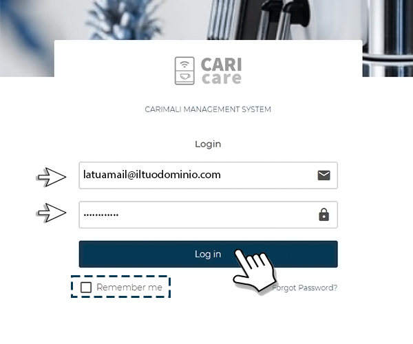

# Gestisci i Tags

La sezione **Tags** ti permette di **creare un'etichetta personalizzata** di riconoscimento di una o più macchine, utile a richiamare velocemente un gruppo di unità. Oltre a questo nella sezione puoi visualizzare **la lista di tutti i tags precedentemente creati**.

## Crea un nuovo Tag

Per **creare un nuovo tag** 

