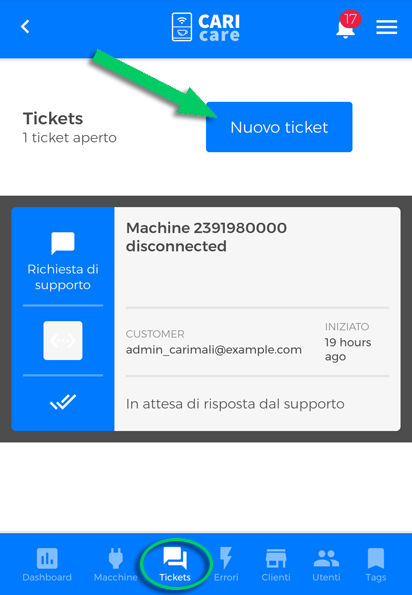

# Contatta il Supporto Tecnico

La sezione **tickets** ti consente di **creare un nuovo ticket** per la richiesta di un supporto tecnico o di tenere traccia dei ticket già creati e attualmente aperti.

## Creare un ticket

Per creare un nuovo **ticket**, clicca su **"Nuovo ticket"**.

<kbd></kbd>

A questo punto hai due modalità di richiesta supporto tecnico:

- **"Richiesta di supporto"**. Con questa modalità puoi impostare la chat come mezzo di comunicazione preferito. Scegli il tipo di problema riscontrato dal menù a discesa **"TYPE"**; seleziona il modello della macchina dal menù a discesa **"Machine"**; compila il campo **"Description"** e premi **"Submit"** per inviare la richiesta di contatto.

<kbd></kbd>

- **"Modalità Richiamami"**. Con questa modalità puoi impostare le chiamate telefoniche come mezzo di comunicazione preferito. Inserisci un numero telefonico e specifica il problema riscontrato compilando il campo **"Descrizione"**. Premi "**Invio**" per inviare il ticket. 

<kbd></kbd>

