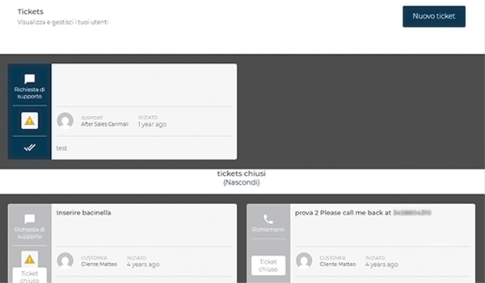
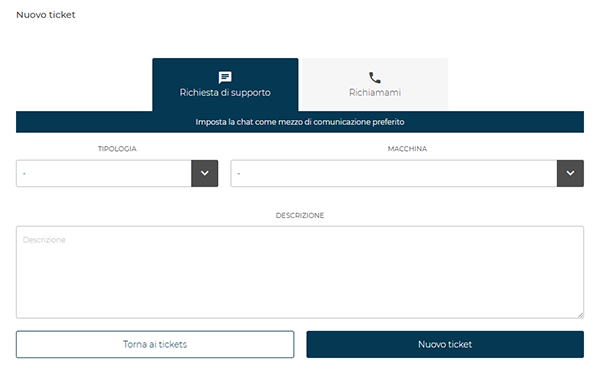
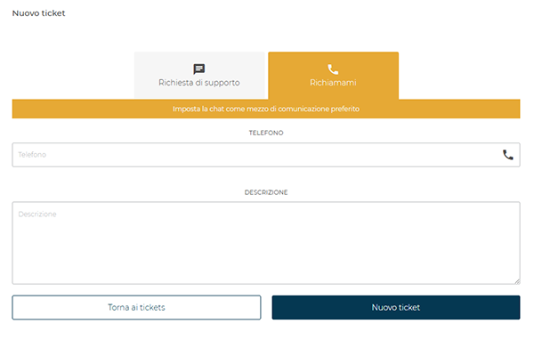
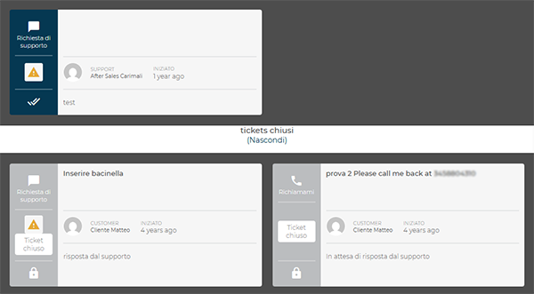
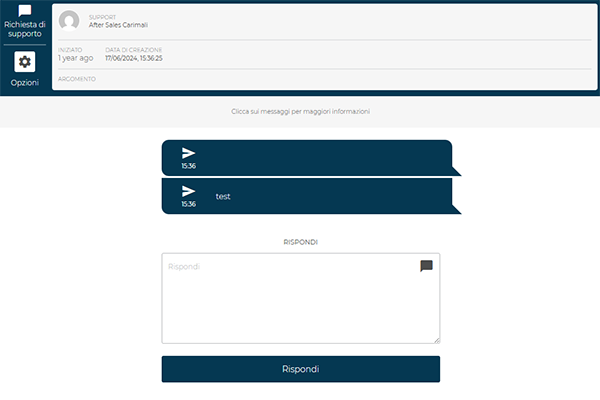
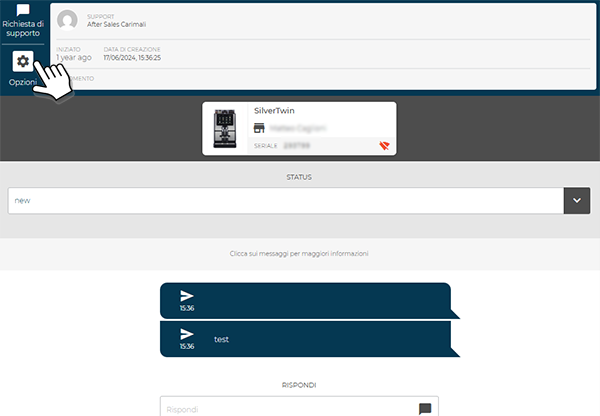

# Contatta il Supporto Tecnico

La sezione **Tickets** consente di **gestire le richieste di assistenza tecnica** e di **monitorare lo stato delle segnalazioni** in corso o concluse.
Da questa pagina è possibile:

* creare un nuovo ticket di supporto;
* visualizzare lo storico delle richieste inviate;
* accedere ai ticket aperti per consultare i messaggi scambiati con il team tecnico.

<kbd></kbd>

## Creazione di un nuovo ticket

<kbd></kbd>

Per aprire una nuova segnalazione, selezionare **Nuovo ticket** in alto a destra.
Si apre la pagina di creazione, nella quale è possibile scegliere una delle due modalità di contatto:

### **Richiesta di supporto** (Chat)

<kbd></kbd>

Questa modalità utilizza la **chat integrata** come canale di comunicazione preferenziale.
Compilare i campi seguenti:

* **Tipologia** – selezionare la categoria del problema dal menù a discesa;
* **Macchina** – scegliere la macchina oggetto della richiesta (si aprirà un menu a tendina con tutte le macchine registrate);
* **Descrizione** – indicare in modo chiaro il malfunzionamento o l’intervento richiesto.

Premere **Nuovo ticket** per inviare la segnalazione oppure **Torna ai tickets** per annullare.

### **Richiamami (Contatto telefonico)**

<kbd></kbd>

Questa modalità consente di **richiedere un contatto telefonico diretto** con il tecnico di supporto.
Inserire un **numero di telefono valido** e una **descrizione del problema** nel campo dedicato.
Confermare con **Nuovo ticket** per inviare la richiesta.

## Gestione dei ticket

Tutti i ticket vengono elencati nella pagina principale, suddivisi tra:

* **Ticket aperti**, visualizzati nella parte superiore;
* **Ticket chiusi**, consultabili cliccando su *Tickets chiusi (Mostra/Nascondi)*.

Ogni scheda mostra:

* il tipo di richiesta (*Richiesta di supporto* o *Richiamami*),
* l’utente coinvolto,
* la data di apertura,
* lo stato del ticket.

<kbd></kbd>

## Consultazione e risposta

Cliccando su un ticket aperto, si accede al dettaglio della conversazione.

<kbd></kbd>

Da questa schermata è possibile:

* visualizzare i **dettagli tecnici** del ticket (supporto assegnato, data di creazione, macchina associata, seriale);
* seguire lo **storico dei messaggi** scambiati con l'assistenza;
* **inviare una risposta** tramite il campo *Rispondi*.

Nel dettaglio del ticket, premendo sull’icona **Opzioni** è possibile accedere a una sezione dedicata che mostra:

* il **dettaglio della macchina associata** alla richiesta (modello macchina, seriale, utente collegato);
* lo **stato attuale del ticket**, con la possibilità di verificarne l’avanzamento (es. *new*, *in progress*, *closed*).

<kbd></kbd>

Questa funzione consente di avere una panoramica completa sul caso in gestione senza uscire dalla conversazione.

> Tutte le comunicazioni vengono registrate nel ticket fino alla **chiusura da parte del tecnico di supporto**.
