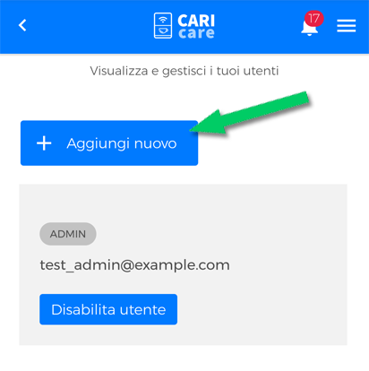
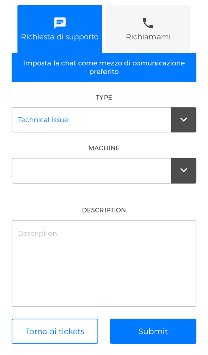

# Contatta Supporto Tecnico

La sezione **tickets** ti consente di **creare un nuovo ticket** per la richiesta di supporto tecnico.

<kbd></kbd>

## Creare un ticket

Per creare un nuovo **ticket**, clicca su **"Nuovo ticket"**

<kbd></kbd>

A questo punto hai due modalità di richiesta supporto tecnico:

- **"Richiesta di supporto"**

<kbd></kbd>

- **"Modalità Richiamami"**

<kbd></kbd>

