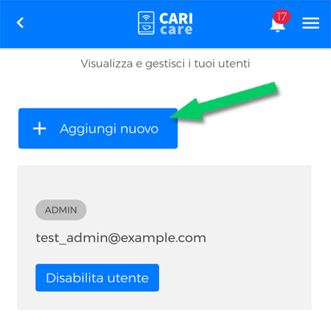
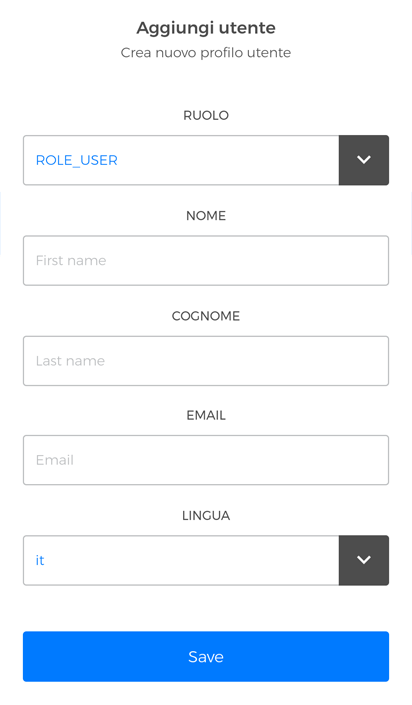
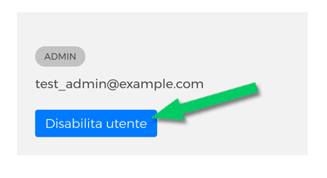

# Gestisci Utenti

La sezione **"Utenti"** ti consente di aggiungere o disabilitare un utente.

## Aggiungi Nuovo Utente

Per **aggiungere un nuovo profilo utente**, clicca sul bottone **"Aggiungi nuovo"**.

<kbd></kbd>

Nella pagina **"Aggiungi Utente"** scegli il ruolo (se "user", "admin", "support" o "dealer"), inserisci "nome", "cognome", "email" e "lingua", quindi premi **"save"** per memorizzare l'inserimento dei dati. 

<kbd></kbd>

## Modifica Utente

Per **modificare un utente**, basta cliccare sul suo riquadro e aggiornare i dati. Non dimenticare di salvare per memorizzare tutte le modifiche.

## Disabilita Utente

Per **disabilitare utente**, clicca sul bottone **"Disabilita utente"** in corrispondenza dell'utente da disabilitare. Un messaggio ti chiederà di confermare la disabilitazione.

<kbd></kbd>
