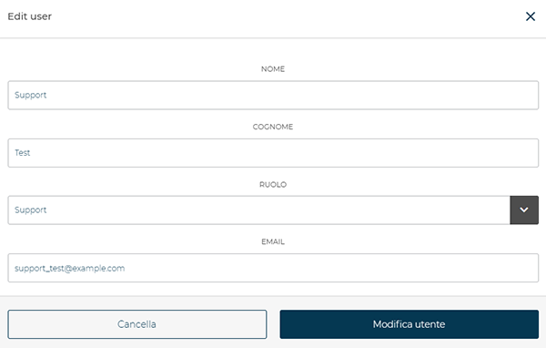

# Gestione Utenti

La sezione **Utenti** consente di **visualizzare**, **aggiungere** o **disabilitare** i profili associati al proprio account.
Da qui è possibile tenere sotto controllo tutti gli utenti registrati, visualizzandone **nome**, **cognome**, **ruolo** e **email**, oltre alle azioni disponibili per ciascuno.

<kbd></kbd>

## Nuovo utente

Per **creare un nuovo profilo**, clicca sul pulsante **Aggiungi nuovo**.

<kbd></kbd>

Si aprirà la finestra **Aggiungi utente**, in cui inserire:

* **Nome** e **Cognome** dell’utente
* **Email** di accesso
* **Ruolo**, scegliendo tra *Admin*, *Manager*, *Support* o *User*

<kbd></kbd>

Dopo aver completato i campi, premi **Aggiungi utente** per salvare il nuovo profilo.

## Modifica utente

<kbd></kbd>

Per **modificare un utente esistente**, è sufficiente cliccare sulla sua **riga** nell’elenco (eccetto che sulla colonna *Azioni*).
Si aprirà la finestra di dettaglio, da cui è possibile aggiornare i dati come *nome*, *cognome*, *email* o *ruolo*.

Al termine delle modifiche, premi **Modifica utente** per applicare e memorizzare le variazioni.

<kbd></kbd>

## Abilitare e disabilitare un utente

<kbd></kbd>

Per **disabilitare o abilitare un utente**, premere il pulsante **Disabilita utente** o **abilita utente** accanto al profilo corrispondente.
Verrà mostrata una finestra di conferma prima di procedere.

<kbd></kbd>